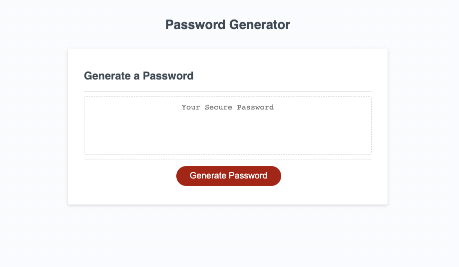

# Password Generator - Module 3 Javascript
## Description

This is the module 3 challenge. In this challenge I modified a password generator

## Live URL

Live URL Link: https://phillipkujawa.github.io/awesome-password-generator-module3/

## Changelog

* Added an IF statement to check if the generated password is undefined and write "Please Try Again"
* Created a series of prompts to make sure the password is at least 8-128 characters long, has numbers, uppercase and lowercase characters 
* Displayed the password in the webpage using a query selector

## Contributor

* @phillipkujawa

## License

MIT License
